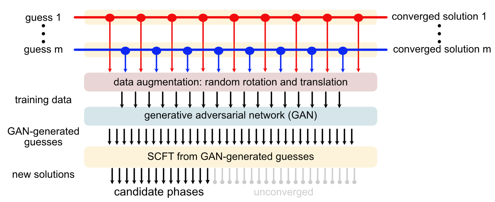
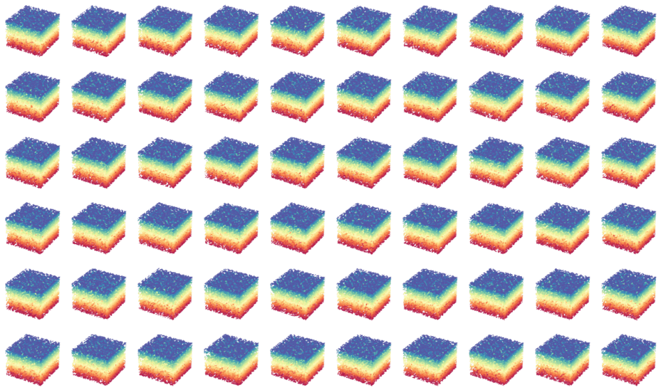
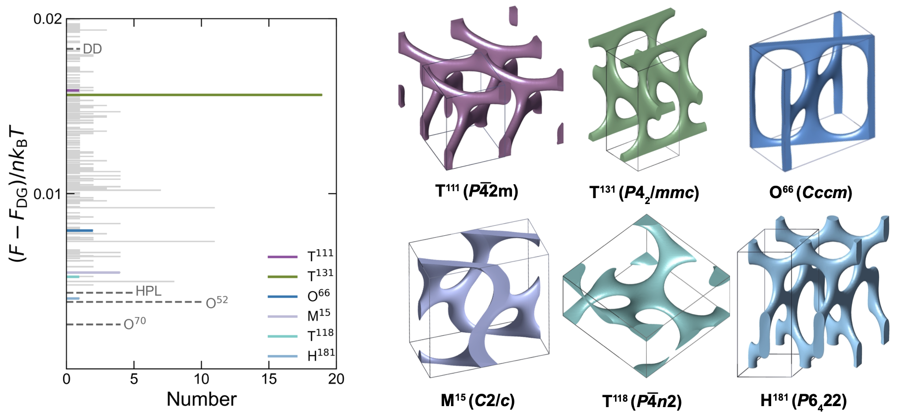

# GANs_SCFT

<!-- TABLE OF CONTENTS -->
## Table of Contents
- [Overview](#overview)
- [Citing this work](#citing-this-work)
- [Relevant work](#relevant-work)
- [Getting Started](#getting-started)
    - [Prerequisites](#prerequisites)
    - [Data Downloads](#data-downloads)
- [Usage](#usage)
    - [Data Generation](#data-generation)
    - [Data Preprocessing](#data-preprocessing)
    - [Training](#training)
    - [Generate guesses using the pretrained GANs](#generate-guesses-using-the-pretrained-gans)
- [Results](#results)

## Overview
This repo is part of the published work [Generative Block Polymer Phase Discovery](http://doi/), which describes a method 
to train Deep Convolutional Generative Adversarial Networks (DCGANs) to generate initial guess fields for self-consistent
field theory (SCFT) simulations for phase discovery.

The DCGANs were trained on a set of 3D density fields of 5 known block polymer phases 
(single-gyroid, single-diamond, single-primitive, double-gyroid, and double diamond) 
generated from SCFT simulation trajectories. A data augmentation strategy, 
including tiling, random translation, and rotation of the fields, was applied. 
Generated fields from the DCGANs were used as initial guess fields to seed new SCFT simulations, 
leading to the discovery of novel phases.

<br>
<p align="center">
<br>
<font size="-1"><b>Fig. 1:</b> Workflow of generated polymer field theory.</font>
</p>

### Citing this work
If you use these codes or parts of them, as well as the information provided in this repo, please cite the following article:

add citation here

### Relevant work
DCGANs was first introduced in the paper [Unsupervised Representation 
Learning with Deep Convolutional Generative Adversarial Networks](https://arxiv.org/abs/1511.06434). 
See also the [DCGAN tutorial](https://pytorch.org/tutorials/beginner/dcgan_faces_tutorial.html) in PyTorch.
The SCFT simulations were performed using the open-source software package [PSCF (C++/CUDA)](https://github.com/dmorse/pscfpp).
The visualization of polymer density fields was performed using the open-source software [Polymer Visual](https://github.com/kdorfmanUMN/polymer_visual.). 

## Getting Started

### Prerequisites
  ```sh
  pip install -r requirements.txt
  ```
### Data Downloads

Both the 'raw' density fields from SCFT simulations and the preprocessed density fields 'data' are available [here](https://link_to_drum_repo). 
The 'data' folder consists of 18,273 3D density field data in '.txt'. Each data point is treated as a gray-scale 3D image (1 x 32 x 32 x 32) for training.

## Usage

### Data Generation 

(The details of data generation can be found in the paper[].)

### Data Preprocessing
Each density field '.rf' file from SCFT calculation is tiled, randomly translated, and rotated for training. 
Data with unphysical density value ($$ \phi_A > 1$$ or $$ \phi_A < 0$$) are excluded.
   ```sh
     cd ./preprocessing
     python data_processor.py --in_filename /path/to/input --out_filename /path/to/output --grid 32 32 32
   ```
--in_filename: path to the input density field file (.rf). <br>
--out_filename: path to the output 3D image file (.txt).<br>
--grid: (optional) a tuple specifying the output size. Default is (32, 32, 32).<br>

The data_processor can also be called as a method in Python.<br>
  ```py
    data_processor = DataProcessor()
    data_processor.process_files(<input_filename>, <output_filename>)
  ```

### Training

Train the DCGANs using preprocessed data:
   ```sh
     cd ./train
     python GAN_train.py --dataroot /path/to/data --out_dir_images /path/to/output/image/dir --out_dir_model /path/to/output/model/dir
   ```
--dataroot: directory that contains processed training data. <br>
--out_dir_images: directory to save generated tensor (.pt) during the training process.<br>
--out_dir_model: directory to save model parameters (.pt) during the training process.<br>
Optional arguments, such as batch size, can be found in the codes.<br>

The output images from a set of fixed noise can be visualized to track the training progression using `isosurface_visualizer'. An example is provided in 'visualize_progress.py':
 ```py
    visualizer = IsosurfaceVisualizer(isosurface_value=0.5)
    visualizer.visualize_directory(<input_directory>, <output_directory>>)
  ```
<input_directory>: directory to the saved generated tensor (.pt).<br>
<output_directory>: directory to save isosurface plots (.png).<br>


<font size="-1"><b>Fig. 2:</b> Progression of generated density fields during the training process.</font>

### Generate guesses using the pretrained GANs

Generate density fields by passing random latent vectors to the generator.
These generated guess fields were then used as input for SCFT calculations.
 ```sh
    cd ./postprocessing
    python generate_guess.py --weight_path ../model/Gweights_45_15.pt --out_dir /path/to/output/dir --num_images 5000
 ```
--weight_path: path to the pretrained generator weights. <br>
--out_dir: directory to save generated guesses (.rf).<br>
--num_images: number of density initial guesses to generate.<br>

## Results
Out of 5,000 SCFT calculations performed at a set state point using GAN-generated initial guesses, 545 converged successfully. 
This led to the identification of 349 candidate network phases after considering degeneracy, 
encompassing all well-known network phases as well as several that had not been previously explored.


<font size="-1"><b>Fig. 3:</b>  Free energy histogram of generated candidate network phases and represented network phases.

## Contributing
For contributing or submitting pull requests, please contact the author:
- Pengyu Chen [chen6580@umn.edu](mailto:chen6580@umn.edu)

## Acknowledgments

The authors would like to thank Qingyuan Jiang, Benjamin R. Magruder, Dr. Guo Kang Cheong, Prof. Chris J. Bartel, 
and Prof. Frank S. Bates for their valuable inputs.
This work was supported primarily by the National Science Foundation through the University of Minnesota MRSEC under Award Number DMR-2011401. 
Computational resources provided in part by the Minnesota Supercomputing Institute.


